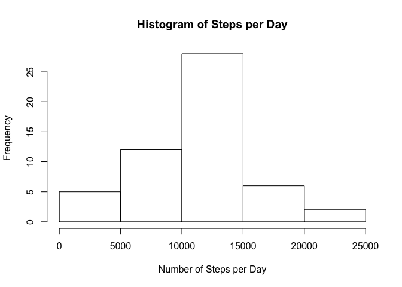
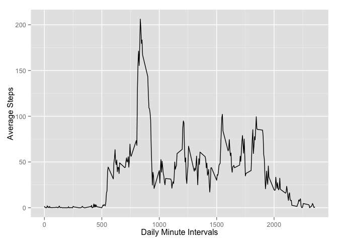
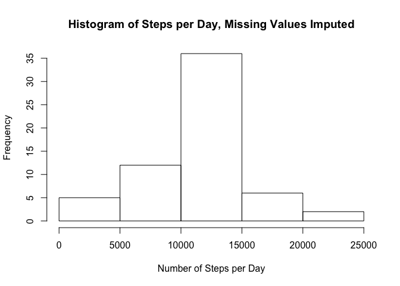
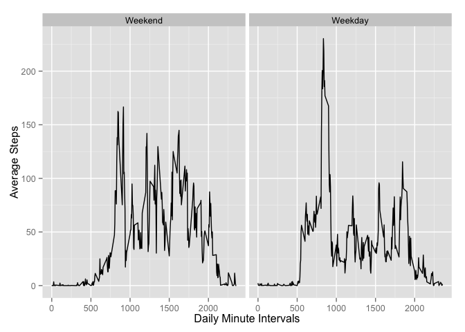

# Reproducible Research: Peer Assessment 1
Andy Hasselwander  
September 15, 2015  


## Loading and preprocessing the data

First, load the data from the github repo. We download the zipped file and then unzip it.

```r
require(RCurl)
```

```
## Loading required package: RCurl
## Loading required package: bitops
```

```r
#check to see if activity.csv exists; if not, go get it.
if(!file.exists("activity.csv")) {
temp <- tempfile()
download.file("https://github.com/opencedar/RepData_PeerAssessment1/blob/master/activity.zip?raw=true", temp, method = "libcurl", mode="wb")
unzip(temp, "activity.csv")}
moveData <- read.csv("activity.csv")
```

Now we can define the date column correctly.

```r
moveData$date <- as.Date(moveData$date, format=("%Y-%m-%d"))
```


## What is mean total number of steps taken per day?

###Histogram of the total number of steps taken per day.

```r
require(data.table)
```

```
## Loading required package: data.table
```

```r
moveDataDT <- as.data.table(moveData)
#use data.table to aggregate sum by date
aggByDate <- moveDataDT[, j =list(steps_by_day = sum(steps, na.rm = FALSE)), by =date]
hist(aggByDate$steps_by_day, main = "Histogram of Steps per Day", xlab = "Number of Steps per Day")
```

 

###Mean and median of the total number of steps taken per day.

```r
meanStepsPerDay <- formatC(mean(aggByDate$steps_by_day, na.rm=TRUE), digits =0, mode="integer", big.mark=",")
medianSteps <- formatC(median(aggByDate$steps_by_day, na.rm=TRUE), digits =0, mode="integer", big.mark=",")
```
* The mean number of steps taken per day is 10,766.
* The median number of steps taken is 10,765.


## What is the average daily activity pattern?

###Make a time series plot (i.e. type = "l") of the 5-minute interval (x-axis) and the average number of steps taken, averaged across all days (y-axis)


```r
#Use data.table() to aggregate by minute interval.
aggByInt <- moveDataDT[, j =list(avg_steps_by_interval = mean(steps, na.rm = TRUE)), by =interval]
require(ggplot2)
```

```
## Loading required package: ggplot2
```

```r
ggplot(aggByInt, aes(interval, avg_steps_by_interval)) + geom_line() +
   xlab("Daily Minute Intervals") + ylab("Average Steps")
```

 

###Which 5-minute interval, on average across all the days in the dataset, contains the maximum number of steps?


```r
whichMax <- which(max(aggByInt$avg_steps_by_interval) == aggByInt$avg_steps_by_interval)
require(xtable)
```

```
## Loading required package: xtable
```

```r
intervalTable <- xtable(aggByInt[whichMax])
print(intervalTable, type = "html")
```

<!-- html table generated in R 3.2.1 by xtable 1.7-4 package -->
<!-- Tue Sep 15 14:52:19 2015 -->
<table border=1>
<tr> <th>  </th> <th> interval </th> <th> avg_steps_by_interval </th>  </tr>
  <tr> <td align="right"> 1 </td> <td align="right"> 835 </td> <td align="right"> 206.17 </td> </tr>
   </table>


## Imputing missing values

Note that there are a number of days/intervals where there are missing values (coded as NA). The presence of missing days may introduce bias into some calculations or summaries of the data.

###Calculate and report the total number of missing values in the dataset (i.e. the total number of rows with NAs):


```r
sum(complete.cases(moveData) == 0)
```

```
## [1] 2304
```

###Devise a strategy for filling in all of the missing values in the dataset. The strategy does not need to be sophisticated. For example, you could use the mean/median for that day, or the mean for that 5-minute interval, etc.

###Create a new dataset that is equal to the original dataset but with the missing data filled in.

The method I have chosen is to take the average for that interval across all days.


```r
filler <- rep(aggByInt$avg_steps_by_interval, times = length(unique(aggByDate$date)))
#check to see the two are the same length
length(filler) == nrow(moveData)
```

```
## [1] TRUE
```

```r
moveDataImputed <- moveData
moveDataImputed$steps[is.na(moveData$steps)] <- filler[is.na(moveData$steps)]
#check to make sure there are no incomplete cases.
sum(!complete.cases(moveDataImputed))
```

```
## [1] 0
```

###Make a histogram of the total number of steps taken each day and Calculate and report the mean and median total number of steps taken per day. Do these values differ from the estimates from the first part of the assignment? What is the impact of imputing missing data on the estimates of the total daily number of steps?


```r
require(data.table)
moveDataImputedDT <- as.data.table(moveDataImputed)
#use data.table to aggregate sum by date
aggByDateImputed <- moveDataImputedDT[, j =list(steps_by_day = sum(steps, na.rm = FALSE)), by =date]
hist(aggByDateImputed$steps_by_day, main = "Histogram of Steps per Day, Missing Values Imputed", xlab = "Number of Steps per Day")
```

 

###Mean and median of the total number of steps taken per day, this time with the values imputed.

```r
meanStepsPerDayImp <- formatC(mean(aggByDateImputed$steps_by_day, na.rm=TRUE), digits =0, mode="integer", big.mark=",")
medianStepsImp <- formatC(median(aggByDateImputed$steps_by_day, na.rm=TRUE), digits =0, mode="integer", big.mark=",")
```
* The mean number of steps taken per day is 10,766.
* The total number of steps taken is 10,766.

* The mean number of steps per day has changed by 0.
* The median number of steps per day has changed by -1.1886792.

There was no impact by imputing. This is not surprising as entire days were missing, and therefore imputation using mean() for the period would just add more "entire days" at average levels.


## Are there differences in activity patterns between weekdays and weekends?

For this part the weekdays() function may be of some help here. Use the dataset with the filled-in missing values for this part.

###Create a new factor variable in the dataset with two levels -- "weekday" and "weekend" indicating whether a given date is a weekday or weekend day.


```r
weekDays <- weekdays(moveDataImputedDT$date)
weekend <- weekDays %in% c("Saturday", "Sunday")
weekendFactor <- vector(length = length(weekend))
weekendFactor <- factor(weekendFactor, levels=c("Weekend", "Weekday"))
weekendFactor[weekend==1] <-  "Weekend"
weekendFactor[weekend==0] <- "Weekday"
moveDataImputedDT <- cbind(moveDataImputedDT, weekendFactor)
```

###Make a panel plot containing a time series plot (i.e. type = "l") of the 5-minute interval (x-axis) and the average number of steps taken, averaged across all weekday days or weekend days (y-axis).


```r
aggByIntImputed <- moveDataImputedDT[, j =list(avg_steps_by_interval = mean(steps, na.rm = TRUE)), by =list(interval, weekendFactor)]
p <- ggplot(aggByIntImputed, aes(interval, avg_steps_by_interval)) + geom_line() +
   xlab("Daily Minute Intervals") + ylab("Average Steps")
# With one variable
p + facet_grid(. ~ weekendFactor)
```

 

There is a clear difference in patterns between weekends and weekdays. On weekdays, steps start very abruptly at ~500, and then peak highly at 900--probably walking to work. Then, steps go down as people are sitting down for work. On weekdays, the distribution of steps in much more evenly distributed throughout the day.
